**Label:**

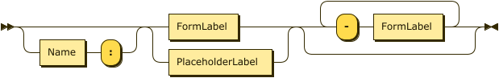

```
Label    ::= ( Name ':' )? FormLabel ( '-' FormLabel )*
```

**FormLabel:**

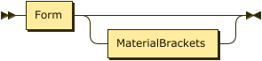

```
FormLabel
         ::= Form MaterialBrackets?
```

referenced by:

* Label

**Name:**

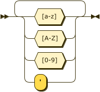

```
Name     ::= [a-zA-Z0-9']+
```

referenced by:

* Entry
* Label

**Form:**

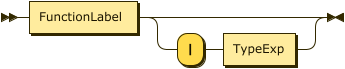

```
Form     ::= FunctionLabel ( '|' TypeExp )?
```

referenced by:

* FormLabel

**FunctionLabel:**

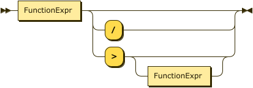

```
FunctionLabel
         ::= FunctionExp ( '/' | '>' FunctionExp? )?
```

referenced by:

* Form

**FunctionExp:**


```
FunctionExp
         ::= Function Shorthand?
```

referenced by:

* FunctionLabel

**Function:**

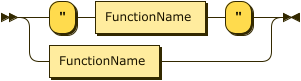

```
Function ::= '"' FunctionName '"'
           | FunctionName
```

referenced by:

* FunctionExp

**FunctionName:**

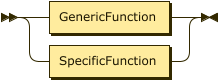

```
FunctionName
         ::= GenericFunction
           | SpecificFunction
```

referenced by:

* Function

**GenericFunction:**

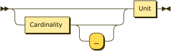

```
GenericFunction
         ::= Count? Unit
```

referenced by:

* FunctionName

**Count:**


```
Count    ::= '1st'
           | '2nd'
           | '3rd'
           | '4th'
           | '5th'
           | '6th'
           | '7th'
           | '8th'
           | '9th'
```

referenced by:

* GenericFunction

**Unit:**

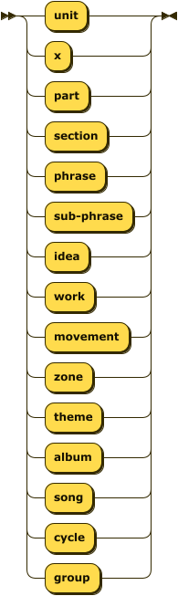

```
Unit     ::= 'unit'
           | 'x'
           | 'part'
           | 'section'
           | 'phrase'
           | 'sub-phrase'
           | 'idea'
           | 'work'
           | 'movement'
           | 'zone'
           | 'theme'
           | 'album'
           | 'song'
           | 'cycle'
           | 'group'
```

referenced by:

* GenericFunction

**SpecificFunction:**

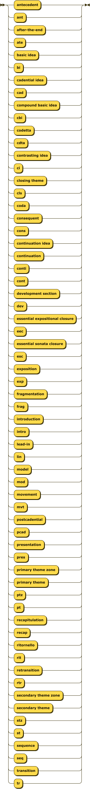

```
SpecificFunction
         ::= 'antecedent'
           | 'ant'
           | 'after-the-end'
           | 'ate'
           | 'basic idea'
           | 'bi'
           | 'cadential idea'
           | 'cad'
           | 'compound basic idea'
           | 'cbi'
           | 'codetta'
           | 'cdta'
           | 'contrasting idea'
           | 'ci'
           | 'closing theme'
           | 'cls'
           | 'coda'
           | 'consequent'
           | 'cons'
           | 'continuation idea'
           | 'continuation'
           | 'conti'
           | 'cont'
           | 'development section'
           | 'dev'
           | 'essential expositional closure'
           | 'eec'
           | 'essential sonata closure'
           | 'esc'
           | 'exposition'
           | 'exp'
           | 'fragmentation'
           | 'frag'
           | 'introduction'
           | 'intro'
           | 'lead-in'
           | 'lin'
           | 'model'
           | 'mod'
           | 'movement'
           | 'mvt'
           | 'postcadential'
           | 'pcad'
           | 'presentation'
           | 'pres'
           | 'primary theme zone'
           | 'primary theme'
           | 'ptz'
           | 'pt'
           | 'recapitulation'
           | 'recap'
           | 'ritornello'
           | 'rit'
           | 'retransition'
           | 'rtr'
           | 'secondary theme zone'
           | 'secondary theme'
           | 'stz'
           | 'st'
           | 'section'
           | 'sec'
           | 'sequence'
           | 'seq'
           | 'transition'
           | 'tr'
```

referenced by:

* FunctionName

**TypeExp:**


```
TypeExp  ::= '"' FormalType '"'
           | FormalType
```

referenced by:

* Form

**FormalType:**

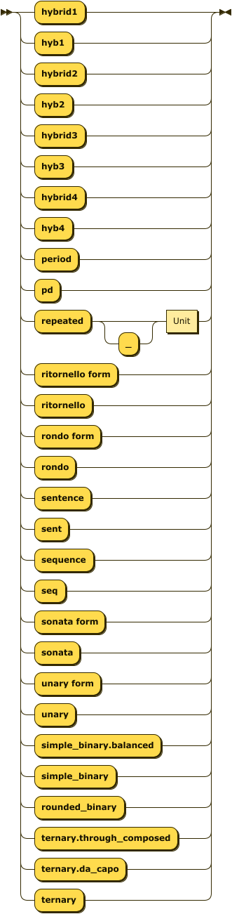

```
FormalType
         ::= 'hybrid1'
           | 'hyb1'
           | 'hybrid2'
           | 'hyb2'
           | 'hybrid3'
           | 'hyb3'
           | 'hybrid4'
           | 'hyb4'
           | 'period'
           | 'pd'
           | 'ritornello form'
           | 'ritornello'
           | 'rondo form'
           | 'rondo'
           | 'sentence'
           | 'sent'
           | 'sequence'
           | 'seq'
           | 'sonata form'
           | 'sonata'
           | 'unary form'
           | 'unary'
           | 'simple_binary.balanced'
           | 'simple_binary'
           | 'rounded_binary'
           | 'ternary.through_composed'
           | 'ternary.da_capo'
           | 'ternary'
```

referenced by:

* TypeExp

**MaterialBrackets:**

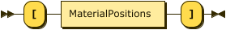

```
MaterialBrackets
         ::= '[' MaterialPositions ']'
```

referenced by:

* FormLabel

**MaterialPositions:**

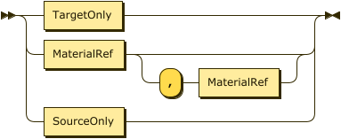

```
MaterialPositions
         ::= ',' MaterialRef
           | MaterialRef ( ',' MaterialRef? )?
```

referenced by:

* MaterialBrackets

**MaterialRef:**

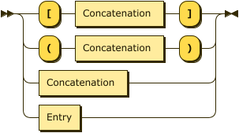

```
MaterialRef
         ::= '[' Concatenation ']'
           | Concatenation
           | Entry
```

referenced by:

* MaterialPositions

**Concatenation:**

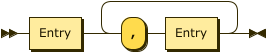

```
Concatenation
         ::= Entry ( ',' Entry )+
```

referenced by:

* MaterialRef

**Shorthand:**

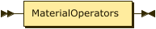

```
Shorthand
         ::= MaterialOperators
```

referenced by:

* FunctionExp

**MaterialOperators:**

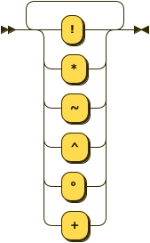

```
MaterialOperators
         ::= [!*~^°+]+
```

referenced by:

* Entry
* Shorthand

**Entry:**

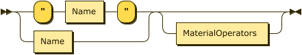

```
Entry    ::= ( '"' Name '"' | Name ) MaterialOperators?
```

referenced by:

* Concatenation
* MaterialRef

## 
 <sup>generated by [RR - Railroad Diagram Generator][RR]</sup>

[RR]: https://www.bottlecaps.de/rr/ui